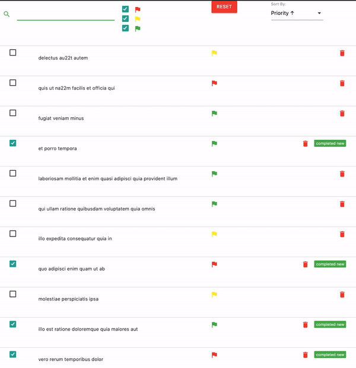

#### Table of Contents

- [Simple Counter](#counter)
- [Simple Toggler](#simple-toggler)
- [Resume List](#resume-list)
- [Props as a child in Context Provider](#props-as-a-child-in-context-provider)

#### Simple Counter

```javascript
import React, { useState } from "react";
import PropTypes from "prop-types";

const SimpleCounter = ({ initial }) => {
  const [counter, setCounter] = useState(initial);

  return (
    <div className="container">
      <div className="row">
        <div className="col s1">
          <span className="flow-text" onClick={(e) => setCounter(counter - 1)}>
            <i className="material-icons red-text">remove_circle_outline</i>
          </span>
        </div>
        <div className="col s2 blue-text">{counter}</div>
        <div className="col s1">
          <span className="flow-text" onClick={(e) => setCounter(counter + 1)}>
            <i className="material-icons green-text">add_circle</i>
          </span>
        </div>
      </div>
    </div>
  );
};

SimpleCounter.propTypes = {
  initial: PropTypes.number.isRequired,
};

export default SimpleCounter;
```

#### Simple Toggler

```javascript
import React, { useState } from "react";
import PropTypes from "prop-types";

const SimpleToggler = ({ value } = { value: false }) => {
  const [toggle, setToggle] = useState(value);
  return (
    <div className="container">
      <div className="switch">
        <label>
          Off
          <input
            type="checkbox"
            onChange={(e) => setToggle(!toggle)}
            value={toggle}
          />
          <span className="lever"></span>
          On
        </label>
      </div>
    </div>
  );
};

SimpleToggler.propTypes = {
  value: PropTypes.bool.isRequired,
};

export default SimpleToggler;
```

#### Resume List

Simple React Application with sort, filter, add item, remove item, add done/undone status

<p></p>

#### Props as a child in Context Provider

The idea behind this is to create context provider and put it inside separated component

```javascript
// test-context-provider.js
import React, { useState } from "react";

export const TestContext = React.createContext();

const TestContextProvider = ({ children }) => {
  const [data, setData] = useState([]);

  return (
    <TestContext.Provider value={{ data, setData }}>
      {children}
    </TestContext.Provider>
  );
};

export default TestContextProvider;
```

```javascript
// test-container.js
import React from "react";
import TestComponentList from "./test-component-list";
import TestComponentButton from "./test-component-button";
import TestContextProvider from "./test-context-provider";

const TestContainer = () => {
  return (
    <TestContextProvider>
      <div className="container">
        <div className="row">
          <TestComponentList />
          <TestComponentButton />
        </div>
      </div>
    </TestContextProvider>
  );
};

export default TestContainer;
```
